Correlation Plots
================
Sara Bolf
3/2/2020

``` r
# read in training data set 
data = read.csv("../Desktop/D2K/trainLowisEAM.csv",header=TRUE)
```

``` r
data_f = subset(data,data$FAIL==1) # data set corresponding to failures

data_nf = subset(data,data$FAIL==0) # data set corresponding to nonfailures
```

``` r
# random sample of data

smp_size = floor(0.01 * nrow(data))

## set the seed to make your partition reproducible

set.seed(123)

train_ind = sample(seq_len(nrow(data)), size = smp_size)

train = data[train_ind, ]
```

``` r
# remove categorical variables 

remove1 = names(train) %in% c("LAST_SCAN_DATE","Well_Name","ALARM_STATUS","POC_TYPE","Nav_Name","POC_MODE","MTR_STATUS","CONTROL_MODE","FLUID_LEVEL_DATE","ServerPrefixID","evt_date","obj_status","evt_type","evt_mrc","evt_code","evt_desc","evt_object","obj_desc","obj_obtype","obj_code","obj_serialno","evt_status","evt_failure","fal_desc","evt_cause","evt_completed","DEPARTMENT","PUMPING.UNIT.ASSET.NUMBER","PUMPING.UNIT.STATUS")

traincor = train[!remove1] # training data without categorical variables

data_nf2 = data_nf[!remove1] # nonfailures without categorical variables

data_f2 = data_f[!remove1] # failures without categorical variables
```

``` r
# remove irrelevant variables/variables with a lot of NAs

remove2 = names(traincor) %in% c("X","FLOW_LINE_PRESSURE","Unnamed..0","evt_priority","evt_downtimehrs","daystocomplete","WELL.API","FAIL","days_until_next_failure")

traincor2 = traincor[!remove2] # training data without irrelevant variables
```

``` r
# only include certain variables that have relatively significant correlations with other variables

add1 = c("BEAM_LOAD","PR_HP_F","PR_HP_C","PUMPSIZE","PUMP_DEPTH_MD","CARD_AREA_C","PEAK_SURF_LOAD_C","CARD_AREA_F","MIN_SURF_LOAD_F","STR_LEN","GB_TORQUE","ACTUAL_STROKE_LENGTH","LOAD_SPAN","WATER")

traincor1 = train[add1] 
```

``` r
# correlation of relatively significant variables
cor(traincor1)
```

    ##                         BEAM_LOAD      PR_HP_F     PR_HP_C    PUMPSIZE
    ## BEAM_LOAD             1.000000000  0.576213060  0.65218241  0.06808086
    ## PR_HP_F               0.576213060  1.000000000  0.84193585  0.24174522
    ## PR_HP_C               0.652182413  0.841935851  1.00000000  0.28129670
    ## PUMPSIZE              0.068080864  0.241745218  0.28129670  1.00000000
    ## PUMP_DEPTH_MD        -0.013062322  0.024106472  0.00495445 -0.28540151
    ## CARD_AREA_C          -0.015499880  0.343979604  0.41140568  0.30056826
    ## PEAK_SURF_LOAD_C      0.036038694  0.169471927  0.18866219 -0.11078914
    ## CARD_AREA_F          -0.026373986  0.360135553  0.38728343  0.26975868
    ## MIN_SURF_LOAD_F       0.005853941 -0.048275722 -0.05183217 -0.32725474
    ## STR_LEN              -0.002679969  0.319203462  0.35347782  0.21832885
    ## GB_TORQUE             0.589706509  0.620064532  0.70802188  0.09211684
    ## ACTUAL_STROKE_LENGTH  0.027735926  0.374448194  0.41128498  0.39774309
    ## LOAD_SPAN             0.069114947 -0.004846579 -0.01118721 -0.25584402
    ## WATER                 0.030707945  0.258812879  0.32874585  0.57749388
    ##                      PUMP_DEPTH_MD CARD_AREA_C PEAK_SURF_LOAD_C CARD_AREA_F
    ## BEAM_LOAD              -0.01306232 -0.01549988       0.03603869 -0.02637399
    ## PR_HP_F                 0.02410647  0.34397960       0.16947193  0.36013555
    ## PR_HP_C                 0.00495445  0.41140568       0.18866219  0.38728343
    ## PUMPSIZE               -0.28540151  0.30056826      -0.11078914  0.26975868
    ## PUMP_DEPTH_MD           1.00000000  0.27037325       0.64720514  0.27566366
    ## CARD_AREA_C             0.27037325  1.00000000       0.61210068  0.89145706
    ## PEAK_SURF_LOAD_C        0.64720514  0.61210068       1.00000000  0.56801111
    ## CARD_AREA_F             0.27566366  0.89145706       0.56801111  1.00000000
    ## MIN_SURF_LOAD_F         0.67194071  0.21845455       0.74883894  0.21116055
    ## STR_LEN                 0.24827286  0.56815311       0.38306627  0.57787784
    ## GB_TORQUE               0.21373838  0.30656758       0.27017825  0.30243504
    ## ACTUAL_STROKE_LENGTH    0.23583303  0.68527132       0.37158745  0.68117340
    ## LOAD_SPAN               0.58949669  0.15963029       0.60599208  0.17120862
    ## WATER                  -0.34569540  0.36927496      -0.08653655  0.31071093
    ##                      MIN_SURF_LOAD_F      STR_LEN  GB_TORQUE
    ## BEAM_LOAD                0.005853941 -0.002679969 0.58970651
    ## PR_HP_F                 -0.048275722  0.319203462 0.62006453
    ## PR_HP_C                 -0.051832166  0.353477824 0.70802188
    ## PUMPSIZE                -0.327254740  0.218328849 0.09211684
    ## PUMP_DEPTH_MD            0.671940711  0.248272863 0.21373838
    ## CARD_AREA_C              0.218454553  0.568153113 0.30656758
    ## PEAK_SURF_LOAD_C         0.748838936  0.383066268 0.27017825
    ## CARD_AREA_F              0.211160553  0.577877841 0.30243504
    ## MIN_SURF_LOAD_F          1.000000000  0.234195487 0.16031508
    ## STR_LEN                  0.234195487  1.000000000 0.30047699
    ## GB_TORQUE                0.160315083  0.300476995 1.00000000
    ## ACTUAL_STROKE_LENGTH     0.159899000  0.725299680 0.36002302
    ## LOAD_SPAN                0.737166059  0.203075540 0.15511851
    ## WATER                   -0.326458529  0.224616114 0.11575385
    ##                      ACTUAL_STROKE_LENGTH    LOAD_SPAN       WATER
    ## BEAM_LOAD                      0.02773593  0.069114947  0.03070795
    ## PR_HP_F                        0.37444819 -0.004846579  0.25881288
    ## PR_HP_C                        0.41128498 -0.011187214  0.32874585
    ## PUMPSIZE                       0.39774309 -0.255844025  0.57749388
    ## PUMP_DEPTH_MD                  0.23583303  0.589496687 -0.34569540
    ## CARD_AREA_C                    0.68527132  0.159630294  0.36927496
    ## PEAK_SURF_LOAD_C               0.37158745  0.605992075 -0.08653655
    ## CARD_AREA_F                    0.68117340  0.171208624  0.31071093
    ## MIN_SURF_LOAD_F                0.15989900  0.737166059 -0.32645853
    ## STR_LEN                        0.72529968  0.203075540  0.22461611
    ## GB_TORQUE                      0.36002302  0.155118514  0.11575385
    ## ACTUAL_STROKE_LENGTH           1.00000000  0.162245156  0.29596788
    ## LOAD_SPAN                      0.16224516  1.000000000 -0.29902917
    ## WATER                          0.29596788 -0.299029169  1.00000000

``` r
# correlation plot of all variables 

ggcorrplot(cor(traincor1),p.mat=cor_pmat(traincor1),hc.order=TRUE,type="lower")
```

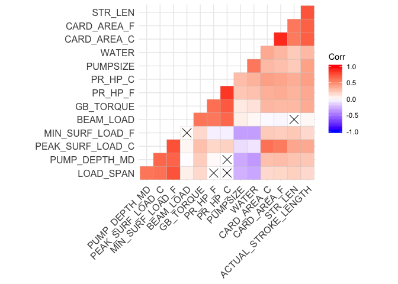

``` r
# correlation plots/matrices for certain variables

a1 = c("BEAM_LOAD","PR_HP_F","PR_HP_C","GB_TORQUE")

plot(train[a1]) 
```

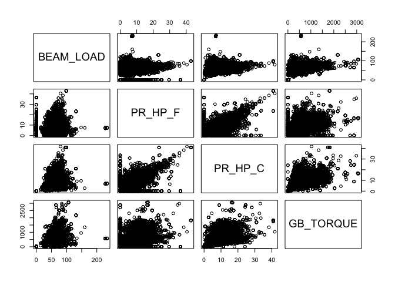

``` r
ggpairs(train[a1]) # correlation matrices
```

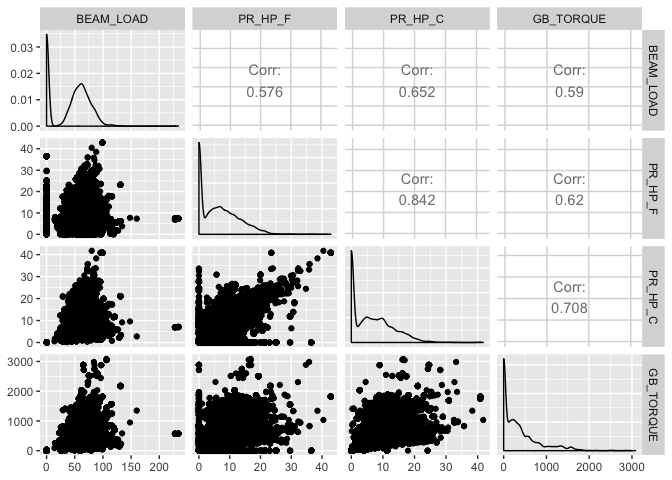

``` r
corrplot.mixed(cor(train[a1]), order="hclust", tl.col="black")
```

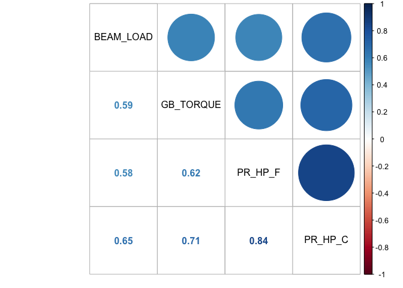

``` r
# correlation plots for certain variables

a2 = c("PUMP_DEPTH_MD","PEAK_SURF_LOAD_C","MIN_SURF_LOAD_F","LOAD_SPAN")

plot(train[a2])
```

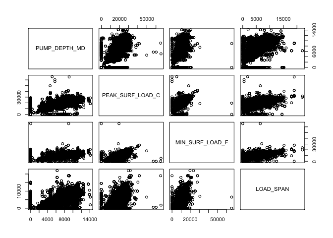

``` r
ggpairs(train[a2]) # correlation matrices
```

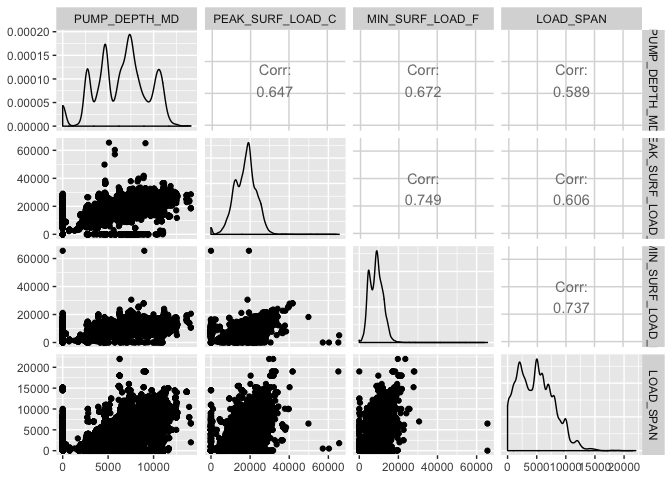

``` r
corrplot.mixed(cor(train[a2]), order="hclust", tl.col="black")
```

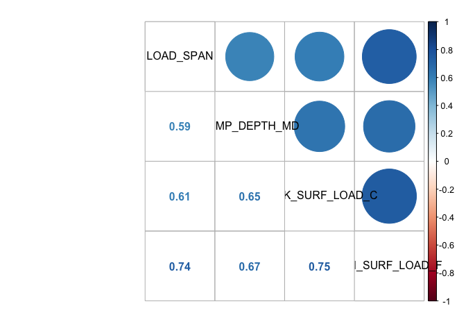

``` r
# correlation plots for certain variables

a3 = c("CARD_AREA_C","CARD_AREA_F","PEAK_SURF_LOAD_C","STR_LEN","ACTUAL_STROKE_LENGTH")

plot(train[a3])
```

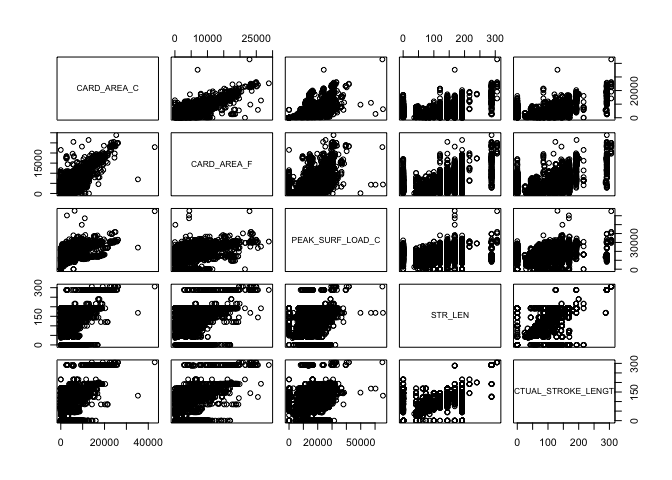

``` r
ggpairs(train[a3]) # correlation matrices
```

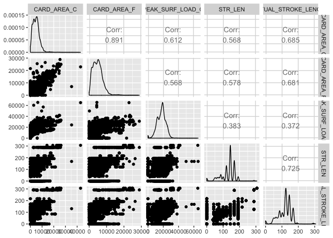

``` r
corrplot.mixed(cor(train[a3]), order="hclust", tl.col="black")
```

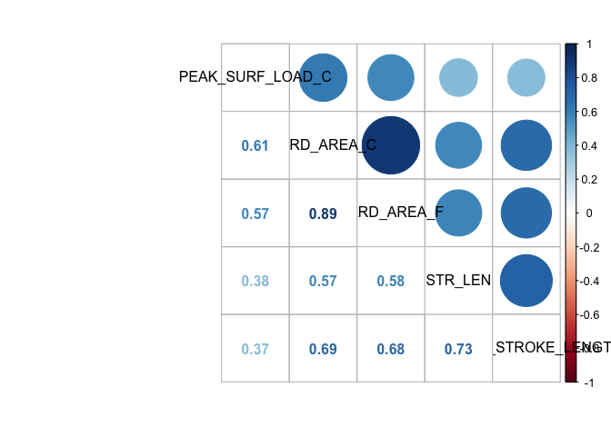

``` r
# Plots of certain correlations between predictor variables (for presentation)

# Correlation between Rod Horsepower and Gearbox Torque

ggplot(train,aes(x=PR_HP_C,y=GB_TORQUE))+geom_point()+geom_smooth()+theme_minimal()+xlab("Polished Rod Horsepower (Current)")+ylab("Gearbox Torque")+ggtitle("Correlation Coefficient: 0.70")+theme(plot.title=element_text(size=15,face="bold.italic"))
```

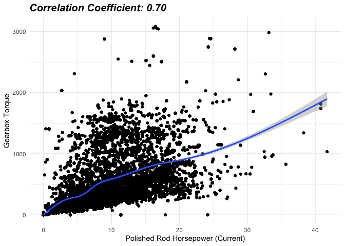

``` r
# Correlation between Min. Surface Load (Full) and Weight of fluid

ggplot(train,aes(x=MIN_SURF_LOAD_F,y=LOAD_SPAN))+geom_point()+geom_smooth()+theme_minimal()+xlab("Minimum Surface Load (Full)")+ylab("Weight of Fluid")+ggtitle("Correlation Coefficient: 0.74")+theme(plot.title=element_text(size=15,face="bold.italic"))
```

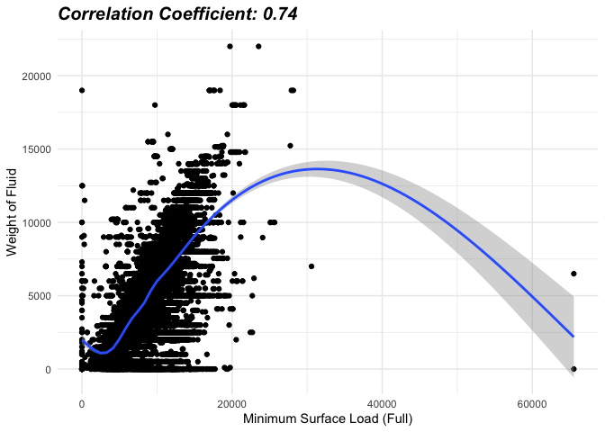

``` r
# Correlation between Card Area (Full) and Actual Stroke Length

ggplot(train,aes(x=CARD_AREA_F,y=ACTUAL_STROKE_LENGTH))+geom_point()+geom_smooth()+theme_minimal()+xlab("Card Area (Full)")+ylab("Actual Stroke Length")+ggtitle("Correlation Coefficient: 0.68")+theme(plot.title=element_text(size=15,face="bold.italic"))
```

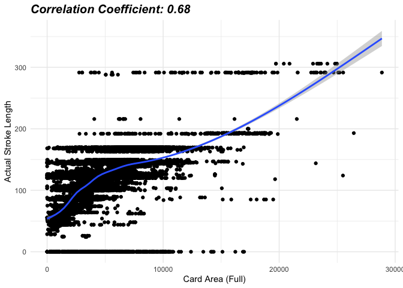

``` r
# Correlation between Min Surface Load (Full) and Pump Depth

ggplot(train,aes(x=MIN_SURF_LOAD_F,y=PUMP_DEPTH_MD))+geom_point()+geom_smooth()+theme_minimal()+xlab("Minimum Surface Load (Full)")+ylab("Pump Depth")+ggtitle("Correlation Coefficient: 0.67")+theme(plot.title=element_text(size=15,face="bold.italic"))
```

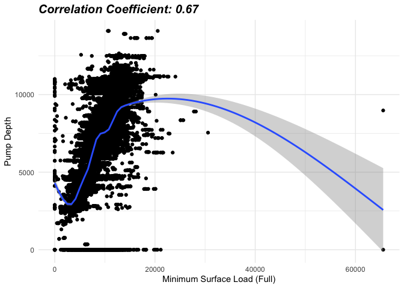

``` r
# correlation plots between certain variables for failures

fa1 = c("BEAM_LOAD","PR_HP_F","PR_HP_C","GB_TORQUE","Unnamed..0")

plot(data_f[fa1])
```

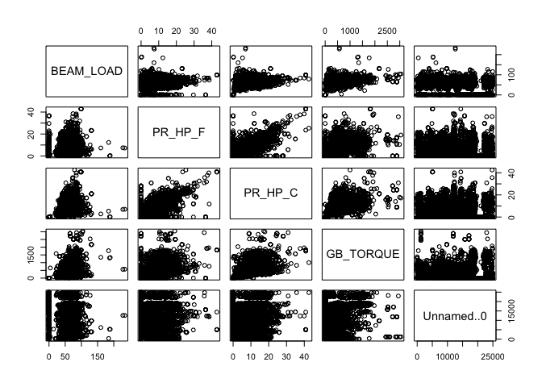

``` r
ggpairs(data_f[fa1]) # correlation matrices
```

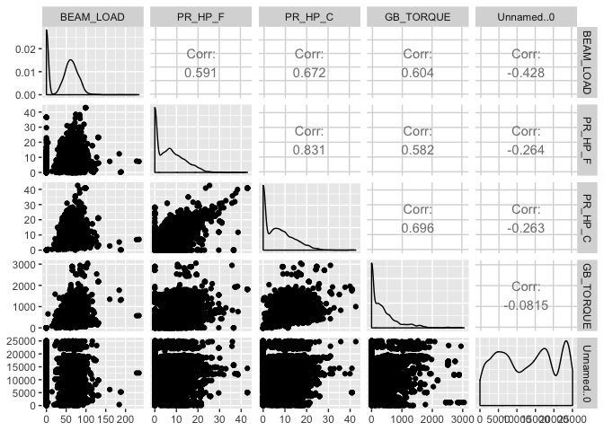

``` r
corrplot.mixed(cor(data_f[fa1]), order="hclust", tl.col="black")
```

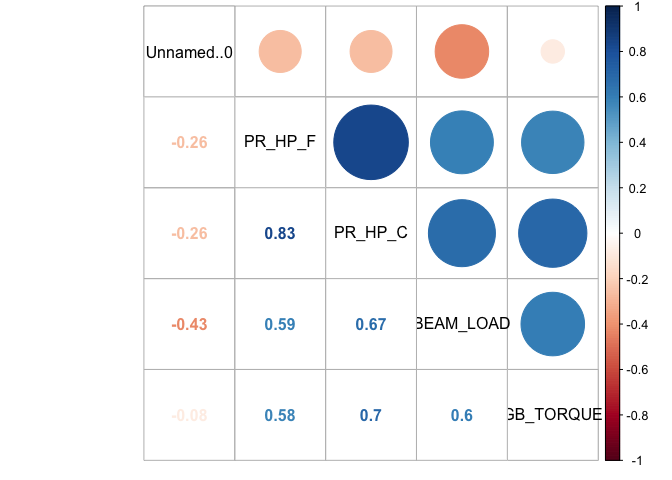

``` r
# subset of data where days_until_next_failure does not equal NA
train_nextfail = subset(traincor,traincor$days_until_next_failure!='NA')
```

``` r
# remove irrelevant variables/variables with a lot of NAs

removenf = names(traincor) %in% c("Unnamed..0","evt_priority","evt_downtimehrs","daystocomplete","WELL.API")

train_nextfail2 = train_nextfail[!removenf]
```

``` r
# correlation of days_until_next_failure with certain variables
cor(train_nextfail2$days_until_next_failure,train_nextfail2[,-1])
```

    ##         BEAM_LOAD     PUMP_EFF     PR_HP_F     PR_HP_C   Y_RUNTIME
    ## [1,] -0.006169154 -0.006528308 -0.01945212 -0.02910378 -0.03636664
    ##      Y_COMM_PERCENT    PUMPSIZE PUMP_DEPTH_MD     Y_CYCLES CARD_AREA_C
    ## [1,]    -0.03789949 0.005184079    -0.0938416 -0.004538683 -0.06781458
    ##      PEAK_SURF_LOAD_C MIN_SURF_LOAD_C CARD_AREA_F PEAK_SURF_LOAD_F
    ## [1,]      -0.09596619      -0.0783773 -0.05783543      -0.08924949
    ##      MIN_SURF_LOAD_F          SPM     STR_LEN   GB_TORQUE ACTUAL_STROKE_LENGTH
    ## [1,]      -0.0865132 -0.007360663 0.000413589 -0.02364126          -0.04247328
    ##      PUMP_EFFICIENCY_SURFACE FLUID_ABOVE_PUMP  LOAD_SPAN PUMP_IDLE_TIME
    ## [1,]            -0.001066884      -0.07005271 -0.1002793   -0.004916999
    ##      FLOW_LINE_PRESSURE          OIL      WATER         GAS      API14
    ## [1,]        -0.02422868 -0.008565402 0.01260686 -0.01175806 0.03889987
    ##             FAIL days_from_start days_until_next_failure
    ## [1,] -0.06076246      -0.3721939                       1

``` r
# scatterplots of days_until_next_failure with certain variables

add1 = c("PUMP_DEPTH_MD","PEAK_SURF_LOAD_C","PEAK_SURF_LOAD_F","LOAD_SPAN","days_from_start","days_until_next_failure")

train_nextfail3 = train_nextfail2[add1]

train_nextfail3 %>%
  gather(-days_until_next_failure,key="var",value="value") %>% 
  ggplot(aes(x=value,y=days_until_next_failure))+facet_wrap(~var,scales="free")+ 
  geom_point()+
  stat_smooth()
```

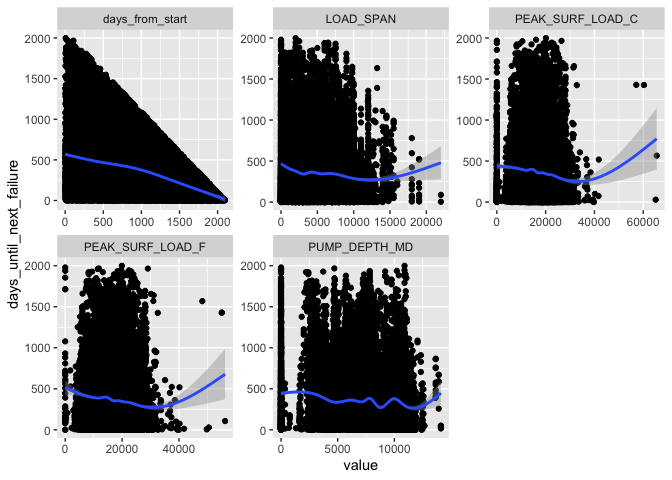

``` r
# Correlations between days until next failure with certain variables (for presentation)

# Correlation between days until next failure and pump depth

ggplot(train_nextfail3,aes(x=PUMP_DEPTH_MD,y=days_until_next_failure))+geom_point()+geom_smooth()+theme_minimal()+xlab("Pump Depth")+ylab("Days until next failure")+ggtitle("Correlation Coefficient: -0.102")+theme(plot.title=element_text(size=15,face="bold.italic"))
```

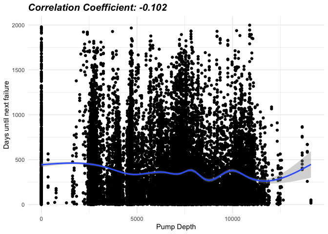

``` r
# correlation between days until next failure and weight of fluid

ggplot(train_nextfail3,aes(x=LOAD_SPAN,y=days_until_next_failure))+geom_point()+geom_smooth()+theme_minimal()+xlab("Weight of Fluid")+ylab("Days until next failure")+ggtitle("Correlation Coefficient: -0.109")+theme(plot.title=element_text(size=15,face="bold.italic"))
```

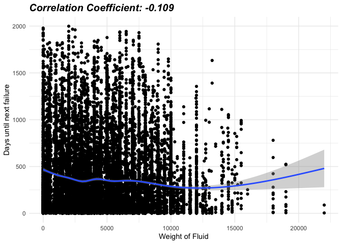

``` r
# correlation between peak surface load (current) and days until next failure

ggplot(train_nextfail3,aes(x=PEAK_SURF_LOAD_C,y=days_until_next_failure))+geom_point()+geom_smooth()+theme_minimal()+xlab("Peak Surface Load (Current)")+ylab("Days until Next Failure")+ggtitle("Correlation Coefficient: -0.101")+theme(plot.title=element_text(size=15,face="bold.italic"))
```

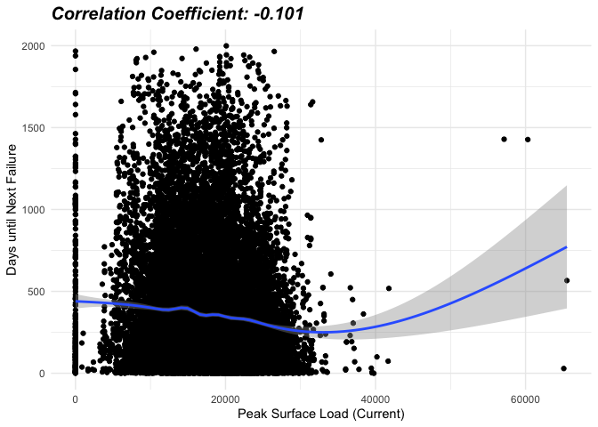
